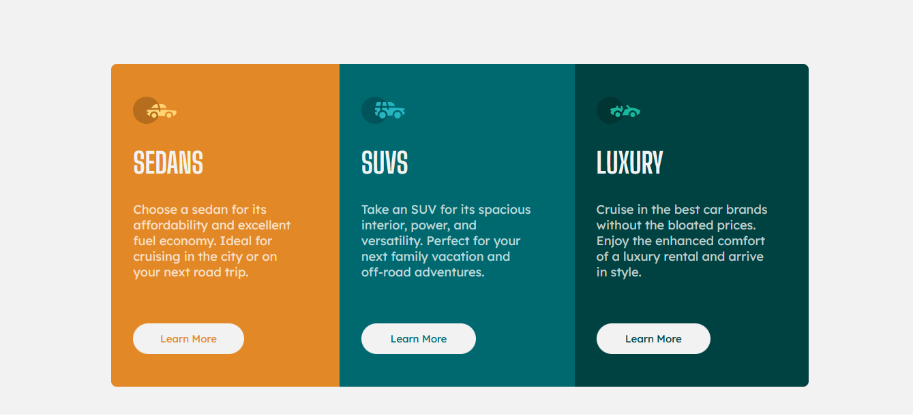

# Frontend Mentor - 3-column preview card component solution

This is a solution to the [3-column preview card component challenge on Frontend Mentor](https://www.frontendmentor.io/challenges/3column-preview-card-component-pH92eAR2-). Frontend Mentor challenges help you improve your coding skills by building realistic projects.

## Table of contents

- [Overview](#overview)
  - [The challenge](#the-challenge)
  - [Screenshot](#screenshot)
  - [Links](#links)
- [My process](#my-process)
  - [Built with](#built-with)
  - [What I learned](#what-i-learned)
  - [Continued development](#continued-development)
  - [Useful resources](#useful-resources)
- [Author](#author)

## Overview

### The challenge

Users should be able to:

- View the optimal layout depending on their device's screen size
- See hover states for interactive elements
### Screenshot

### Links

- Solution URL: [Github](https://github.com/OmKakatkar/3-column-preview-card-component)
- Live Site URL: [Hosted on Netlify](https://3-column-preview1.netlify.app/)

## My process

### Built with

- Mobile First
- Semantic HTML5 markup
- CSS custom properties
- Flexbox
### Continued development

It was a good practice for flexbox. I've got a hang of using flexbox in designs. First think of the design, draw it on paper if you cannot visualize and once set start coding. 
### Useful resources

[PerfectPixel by WellDoneCode (pixel perfect)] is a browser extension that help in getting pixel perfect accuracy in design implementation
## Author

- Website - [Om Kakatkar](https://omkakatkar-portfolio.netlify.app/)
- Frontend Mentor - [@OmKakatkar](https://www.frontendmentor.io/profile/OmKakatkar)
- Twitter - [@omkakatkar](https://twitter.com/omkakatkar)
